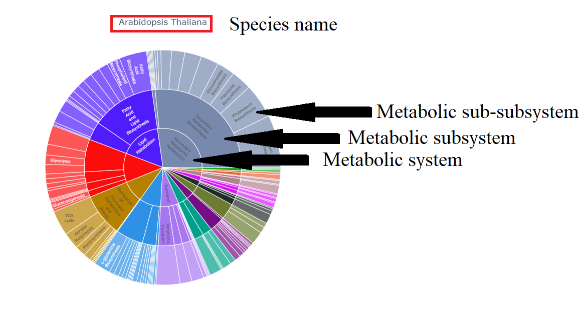

Welcome to cancer hallmarks article supplementary information website

This GitHub website compresseses interactive metabolic sunbursts
for ten Cancer-hallmarks and two species _A. thaliana_ and _H. sapiens_

Please click on the following links to open the interactive sunbursts.
Each graphic represent metabolic system, sub-subsystem, and sub-subsystem,
starting from the center of the figure. At click on the element the number
of genes in a category will be displayed.

# **System, subsystem and sub-subsystems per specie
[Link](https://ccsosa.github.io/TEST_CH/GENERAL-AT.html). _A. thaliana_

[Link](https://ccsosa.github.io/TEST_CH/GENERAL-HS.html). _H. sapiens_

## **System, subsystem and sub-subsystems for _A. thaliana_ cancer hallmarks

[Link](https://ccsosa.github.io/TEST_CH/AID-AT.html). AID
[Link](https://ccsosa.github.io/TEST_CH/AIM-AT.html). AIM
[Link](https://ccsosa.github.io/TEST_CH/DCE-AT.html). DCE
[Link](https://ccsosa.github.io/TEST_CH/EGS-AT.html). EGS
[Link](https://ccsosa.github.io/TEST_CH/ERI-AT.html). ERI
[Link](https://ccsosa.github.io/TEST_CH/GIM-AT.html). GIM
[Link](https://ccsosa.github.io/TEST_CH/IA-AT.html). IA
[Link](https://ccsosa.github.io/TEST_CH/RCD-AT.html). RCD
[Link](https://ccsosa.github.io/TEST_CH/SPS-AT.html). SPS
[Link](https://ccsosa.github.io/TEST_CH/TPI-AT.html). TPI

## **System, subsystem and sub-subsystems for _H. sapiens_ cancer hallmarks

[Link](https://ccsosa.github.io/TEST_CH/AID-HS.html). AID
[Link](https://ccsosa.github.io/TEST_CH/AIM-HS.html). AIM
[Link](https://ccsosa.github.io/TEST_CH/DCE-HS.html). DCE
[Link](https://ccsosa.github.io/TEST_CH/EGS-HS.html). EGS
[Link](https://ccsosa.github.io/TEST_CH/ERI-HS.html). ERI
[Link](https://ccsosa.github.io/TEST_CH/GIM-HS.html). GIM
[Link](https://ccsosa.github.io/TEST_CH/IA-HS.html). IA
[Link](https://ccsosa.github.io/TEST_CH/RCD-HS.html). RCD
[Link](https://ccsosa.github.io/TEST_CH/SPS-HS.html). SPS
[Link](https://ccsosa.github.io/TEST_CH/TPI-HS.html). TPI
